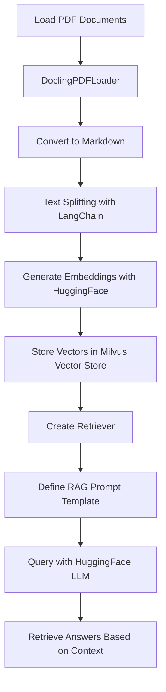

# Docling RAG with LangChain on Colab

This repository demonstrates how to set up a Retrieval-Augmented Generation (RAG) pipeline using **Docling**, **LangChain**, and **Colab**. This setup allows for efficient document processing, embedding generation, vector storage, and querying with a Language Model (LLM). The following sections elaborate on the workflow, components, and implementation details.

---
PDF Supported
---

## **Overview**

The pipeline combines:
1. **Docling**: For document loading and conversion into structured formats (Markdown, JSON, YAML, etc.).
2. **LangChain**: For splitting documents, generating embeddings, and querying with a retriever and LLM.
3. **Colab**: For interactive development and leveraging HuggingFace APIs.

---

## **Workflow Diagram**



---

## **Setup Instructions**

### **Prerequisites**
- A Colab environment with internet access.
- HuggingFace account for API tokens.
- Python libraries: `docling`, `langchain`, `python-dotenv`, and vector storage tools like `Milvus`.

---

### **Installation**

Install the required libraries:
```bash
%pip install -qq docling docling-core python-dotenv langchain-text-splitters langchain-huggingface langchain-milvus
```

---

### **Usage**

#### **1. Loading Documents**
- Documents are loaded using `DoclingPDFLoader`, which supports single or multiple PDF paths.
- Converts PDF content into structured text formats (e.g., Markdown).

#### **2. Splitting Documents**
- Use `RecursiveCharacterTextSplitter` to divide content into chunks.
- Adjust `chunk_size` and `chunk_overlap` for better granularity.

#### **3. Generating Embeddings**
- Use `HuggingFaceEmbeddings` to generate semantic vector embeddings.
- Select the embedding model (e.g., `sentence-transformers/all-MiniLM-L6-v2`).

#### **4. Vector Storage**
- Store document embeddings in a `Milvus` vector database.
- The temporary database is created using Python's `TemporaryDirectory`.

#### **5. Retrieval-Augmented Generation (RAG)**
- Use the retriever to fetch relevant context based on input queries.
- Define a prompt template for the LLM to generate responses.

#### **6. Query Execution**
- Execute queries using the RAG chain to retrieve context-aware answers.

---

## **Code Highlights**

### **Document Loading**
```python
from docling.document_converter import DocumentConverter

class DoclingPDFLoader(BaseLoader):
    def __init__(self, file_path):
        self._file_paths = file_path if isinstance(file_path, list) else [file_path]
        self._converter = DocumentConverter()

    def lazy_load(self):
        for source in self._file_paths:
            dl_doc = self._converter.convert(source).document
            text = dl_doc.export_to_markdown(strict_text=True)
            yield LCDocument(page_content=text)
```

### **Text Splitting**
```python
from langchain_text_splitters import RecursiveCharacterTextSplitter

text_splitter = RecursiveCharacterTextSplitter(
    chunk_size=1000,
    chunk_overlap=200,
)
```

### **Embedding Generation**
```python
from langchain_huggingface.embeddings import HuggingFaceEmbeddings

HF_EMBED_MODEL_ID = "sentence-transformers/all-MiniLM-L6-v2"
embeddings = HuggingFaceEmbeddings(model_name=HF_EMBED_MODEL_ID)
```

### **Vector Storage**
```python
from langchain_milvus import Milvus

vectorstore = Milvus.from_documents(
    splits,
    embeddings,
    connection_args={"uri": MILVUS_URI},
    drop_old=True,
)
```

### **RAG Chain**
```python
from langchain_core.prompts import PromptTemplate
from langchain_core.runnables import RunnablePassthrough

retriever = vectorstore.as_retriever()

prompt = PromptTemplate.from_template(
    "Context information is below.\n---------------------\n{context}\n---------------------\n"
    "Given the context information and not prior knowledge, answer the query.\nQuery: {question}\nAnswer:\n"
)

rag_chain = (
    {"context": retriever | format_docs, "question": RunnablePassthrough()}
    | prompt
    | llm
    | StrOutputParser()
)
```

---

## **Key Features**
1. **Modular Design**: Easily customizable for different documents and queries.
2. **RAG Pipeline**: Combines retrieval and generation for context-aware answers.
3. **Embedding Flexibility**: Supports various HuggingFace embedding models.
4. **Vector Store Integration**: Efficient vector management with Milvus.
5. **Interactive Queries**: Leverages HuggingFace LLM for accurate responses.

---

## **Example Queries**
```python
rag_chain.invoke("Does Docling implement a linear pipeline of operations?")
rag_chain.invoke("How many pages were human annotated for DocLayNet?")
```

---

## **References**
- [Docling Official Documentation](https://ds4sd.github.io/docling/examples/rag_langchain/)
- [LangChain Documentation](https://docs.langchain.com/)
- [HuggingFace Models](https://huggingface.co/)

---

## **Author**
**Partha Pratim Ray**  
GitHub: [ParthaPRay](https://github.com/ParthaPRay)  
```

